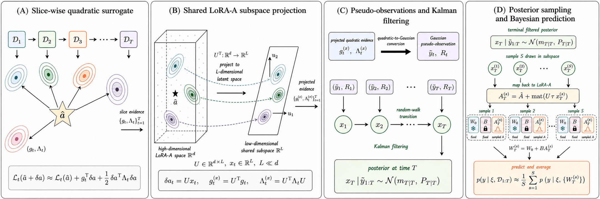

# Seq-LoRA: Sequential Bayesian Low-Rank Adaptation for Large Language Models

Official implementation of **Seq-LoRA** (NeurIPS 2026).

**Authors:** _to be added_ · **Paper:** _link coming soon_ · [Citation](#citation)

<p align="center">
  
</p>

Low-Rank Adaptation (LoRA) fine-tunes large language models efficiently, but the
adapted models are often overconfident, especially with little data or under
distribution shift. **Seq-LoRA** is a post-hoc Bayesian framework that
sequentially aggregates slice-wise posterior evidence in LoRA space. Starting
from a shared MAP LoRA anchor, Seq-LoRA

1. builds slice-wise Kronecker-factored (K-FAC) quadratic surrogates of the loss
   on structured subsets ("slices") of the training data;
2. projects them into a shared, curvature-informed low-dimensional subspace of
   the LoRA-A parameters;
3. rewrites the projected quadratic forms as Gaussian pseudo-observations and
   performs exact inference in the induced linear-Gaussian state-space model by
   Kalman filtering, with slice-wise evidence coupled through a random-walk prior;
4. samples LoRA adapters from the terminal posterior and averages their
   predictions (Bayesian model averaging).

The base model is never retrained: Seq-LoRA operates on a fixed MAP checkpoint
and improves calibration and negative log-likelihood most clearly under
distribution shift, while preserving most task accuracy.

## Contents

- [Repository layout](#repository-layout)
- [Installation](#installation)
- [Models and datasets](#models-and-datasets)
- [Quickstart](#quickstart)
- [Reproducing the paper](#reproducing-the-paper)
- [Main results](#main-results)
- [Implementation notes](#implementation-notes)
- [Third-party code](#third-party-code)
- [Citation](#citation)
- [License](#license)

## Repository layout

```text
seq_lora/            Seq-LoRA method
  algorithm/           K-FAC (ASDL), subspaces, pseudo-observations, process noise,
                       LGSSM / Kalman inference, posterior sampling, tau calibration
  data/                ScienceQA slice construction
  eval/                `python -m seq_lora.eval`: posterior construction + Bayesian evaluation
evaluation/          shared datasets, prompts, answer-token scoring, metrics, checkpoint loading
training/            MAP LoRA training on ScienceQA (grade / reverse / random order)
baselines/           Base, MAP, MC-Dropout, Deep Ensemble, Laplace-LoRA, BLoB, TFB, C-LoRA
  laplace/             Laplace-LoRA (adapted from laplace-lora)
  bayesian-peft/       BLoB / TFB (adapted from Bayesian-PEFT); qwen3/ = Qwen3 runner
  c_lora/              C-LoRA (adapted from the official code); qwen3/ = Qwen3 runner
scripts/             one launcher per (experiment, method) used in the paper
assets/              README figure
```

| Pipeline stage | Files | What they do |
| --- | --- | --- |
| MAP training | `training/scienceqa_map.py` | Trains Qwen3 MAP LoRA adapters (grade, reverse-grade, or random order) and saves `init_lora.pt`, intermediate checkpoints, and `map_step_2000`. |
| Datasets and prompts | `evaluation/common.py` | Loads ScienceQA, OBQA, ARC, MMLU, and GPQA; builds multiple-choice prompts; computes answer-token ids and metrics. |
| Protocol compatibility | `evaluation/protocols.py`, `evaluation/bayesian_peft_data.py` | Switches between the Qwen3 protocol and the Llama-2 / Bayesian-PEFT protocol used for transfer runs. |
| Checkpoints, logits, runtime | `evaluation/checkpoints.py`, `evaluation/logits.py`, `evaluation/runtime.py` | Loads PEFT adapters, computes masked choice logits, trims the LM head, and records time and memory. |
| Slice construction | `seq_lora/data/make_scienceqa_slices.py`, `mcqa_slices.py`, `slices.py` | Builds the `T`-slice partitions and the reverse / shuffled / random / base-loss control slices. |
| Seq-LoRA posterior | `seq_lora/algorithm/*.py` | K-FAC extraction, subspace projection, pseudo-observations, process noise, Kalman inference, posterior sampling, posterior-scale (`tau`) calibration. |
| Seq-LoRA evaluation | `seq_lora/eval/runner.py`, `cache.py` | Implements `python -m seq_lora.eval`, caches posterior statistics, and evaluates the Bayesian model average. |
| Baselines | `baselines/*_eval.py`, `baselines/laplace/eval.py`, `baselines/bayesian-peft/qwen3/`, `baselines/c_lora/qwen3/` | Base, MAP, MC-Dropout, ensemble, Laplace-LoRA, BLoB, TFB, and C-LoRA. |
| Launchers | `scripts/_common.sh`, `scripts/qwen3/**`, `scripts/llama2/**` | Fix the seeds, checkpoint paths, tasks, and log locations of every paper experiment. |

More detail: [`seq_lora/README.md`](seq_lora/README.md) (package and CLI options) and
[`scripts/README.md`](scripts/README.md) (all launchers and their overrides).

## Installation

The experiments use Python 3.12 and a CUDA GPU.

```bash
git clone https://github.com/toori999/seq-lora.git
cd seq-lora
conda create -n seq-lora python=3.12 -y
conda activate seq-lora
python -m pip install --upgrade pip
python -m pip install -r requirements.txt
```

`requirements.txt` pins the CUDA 12.9 build of PyTorch 2.11 used for the paper.
For a different CUDA runtime, replace the `torch`, `torchvision`, and
`torchaudio` pins (and the extra index URL) with a matching build first.

Run the Python commands below from the repository root. The launchers in
`scripts/` change into the repository root themselves and use `python` from
your `PATH`; set `PY=/path/to/python` to choose another interpreter. Logs are
written under `logs/`, posterior-statistics caches under `caches/`, and slice
datasets under `slice_data/` (all ignored by git).

## Models and datasets

Models and datasets are downloaded from the Hugging Face Hub on first use:

| Asset | Hugging Face ID | Role |
| --- | --- | --- |
| Qwen3-8B-Base | `Qwen/Qwen3-8B-Base` | main backbone |
| Llama 2 7B | `meta-llama/Llama-2-7b-hf` (gated) | additional OBQA transfer backbone |
| ScienceQA (text-only) | `tcallens/scienceqa-text-only` | training (grades 2–11), ID test, Grade 12 OOD |
| OpenBookQA | `allenai/openbookqa` (`main`) | OOD target; source task for transfer |
| AI2 ARC | `allenai/ai2_arc` (Challenge / Easy) | OOD targets |
| MMLU | `cais/mmlu` (high-school / college physics, chemistry, biology) | OOD targets MMLU-H / MMLU-C |
| GPQA | `Idavidrein/gpqa` (`gpqa_main`, gated) | OOD target |

Gated assets require accepting their terms on the Hub and logging in
(`hf auth login`). This repository does not redistribute model weights or
benchmark data; each asset remains under its own license and terms. To use
pre-downloaded assets, point the caches at them:

```bash
export HF_HOME=/path/to/hf_home
export HF_DATASETS_CACHE=/path/to/hf_datasets_cache
```

## Quickstart

Seq-LoRA on ScienceQA for one seed, from MAP training to the ID/OOD evaluation:

```bash
# 1. Train the MAP LoRA anchor (Qwen3-8B-Base, ScienceQA grades 2-11, grade order).
python -m training.scienceqa_map --train_order order --seeds 1

# 2. Build the grade slices (T = 1, 5, 10, 20).
python -m seq_lora.data.make_scienceqa_slices --preset t_ablation

# 3. Build the Seq-LoRA posterior (T = 10 grade slices) and evaluate it on the
#    ID test split and the six OOD targets.
SEEDS="1" bash scripts/qwen3/scienceqa/scienceqa_main/run_seq.sh
```

The log `logs/qwen3/scienceqa/scienceqa_main/seq/seed1.log` reports `acc_bayes`,
`nll_bayes`, `ece_bayes`, and `brier_bayes` for every target. The underlying
command is a single call to `python -m seq_lora.eval`; see the launcher for
the full argument list and [`seq_lora/README.md`](seq_lora/README.md) for the
options.

## Reproducing the paper

Every experiment has a launcher under `scripts/` that encodes the seeds and
settings of the reported runs. The paper's efficiency measurements used a single
NVIDIA RTX PRO 6000 GPU (96 GB).

| Experiment | Launchers |
| --- | --- |
| Main ID / OOD results (Table 1) | `scripts/qwen3/scienceqa/scienceqa_main/run_{base,map,mcdrop,ensemble,laplace,blob,tfb,clora,seq}.sh` |
| Slice granularity `T` | `scripts/qwen3/scienceqa/scienceqa_ablations/t_granularity/run.sh` |
| Slice-structure and coupling ablations | `scripts/qwen3/scienceqa/scienceqa_ablations/slice_structure/run.sh` |
| MAP training-order control | `scripts/qwen3/scienceqa/map_training_order/run_{train,eval}.sh` |
| Dense `T` / posterior-scale sweeps (appendix figures) | `scripts/qwen3/scienceqa/scienceqa_ablations/tau_t_sweep/run.sh`, `plot_t10_tau_grid.py` |
| Qwen3 OBQA → ARC / MMLU transfer | `scripts/qwen3/obqa_transfer/run_*.sh` |
| Llama-2 OBQA → ARC / MMLU transfer | `scripts/llama2/obqa_transfer/run_*.sh` |

### 1. MAP adapters

Most methods use seeds 1, 3, 7, 11, 13. The MAP order control also needs
reverse-grade and random-order adapters, and the Deep Ensemble row uses 25 MAP
adapters (seeds 0–24, five ensembles of five).

```bash
SEEDS=1,3,7,11,13 TRAIN_ORDERS="order reverse random" \
  bash scripts/qwen3/scienceqa/map_training_order/run_train.sh

SEEDS=0,2,4,5,6,8,9,10,12,14,15,16,17,18,19,20,21,22,23,24 TRAIN_ORDERS=order \
  bash scripts/qwen3/scienceqa/map_training_order/run_train.sh
```

### 2. Slice datasets

```bash
python -m seq_lora.data.make_scienceqa_slices --preset all
```

`--preset all` builds the `T` partitions, the dense `T` grid, and the
slice-structure controls, reproducing the exact slice datasets used for the paper
(see [Reproducibility notes](#reproducibility-notes)).

### 3. Main results (Table 1)

```bash
for method in base map mcdrop ensemble laplace tfb blob clora seq; do
  bash "scripts/qwen3/scienceqa/scienceqa_main/run_${method}.sh"
done
```

### 4. Ablations

```bash
bash scripts/qwen3/scienceqa/map_training_order/run_eval.sh
bash scripts/qwen3/scienceqa/scienceqa_ablations/t_granularity/run.sh
bash scripts/qwen3/scienceqa/scienceqa_ablations/slice_structure/run.sh

# Dense T sweep under automatic and fixed posterior scales.
bash scripts/qwen3/scienceqa/scienceqa_ablations/tau_t_sweep/run.sh

# Fixed-tau sensitivity at T = 10, then the figure. The plot also reads the
# tau = 0 (MAP) row written by the slice-structure launcher.
TS=10 MODES="tau0p1 tau0p2 tau0p3 tau0p4 tau05 tau0p6 tau0p7 tau0p8 tau0p9 tau1" \
  bash scripts/qwen3/scienceqa/scienceqa_ablations/tau_t_sweep/run.sh
python scripts/qwen3/scienceqa/scienceqa_ablations/tau_t_sweep/plot_t10_tau_grid.py
```

### 5. OBQA → ARC / MMLU transfer

Qwen3 (seeds 1, 3, 7):

```bash
for method in map mcdrop ensemble laplace tfb blob clora seq; do
  bash "scripts/qwen3/obqa_transfer/run_${method}.sh"
done
```

These launchers expect Qwen3 OBQA MAP adapters under
`iid_qwen35_8b_obqa_lora_map_leftpad/obqa_qv_lmhead_leftpad/seed_<seed>/`
(`init_lora.pt` and `map_step_2000/`), trained with the same MAP recipe as
ScienceQA (paper appendix); the training script for this setting is not part of
this release.

Llama-2 (seeds 1, 3, 7):

```bash
for method in map mcdrop ensemble laplace clora seq; do
  bash "scripts/llama2/obqa_transfer/run_${method}.sh"
done
```

These launchers expect Bayesian-PEFT MLE adapters under
`baselines/bayesian-peft/checkpoints/mle/meta-llama/Llama-2-7b-hf/obqa/`; see
[`scripts/llama2/obqa_transfer/README.md`](scripts/llama2/obqa_transfer/README.md)
for how to train them and for the BLoB / TFB rows.

### Reproducibility notes

- Results are mean ± standard deviation over five seeds (three for the
  transfer benchmarks). Expect small run-to-run differences from GPU
  nondeterminism.
- Seq-LoRA posterior statistics (K-FAC factors, subspaces, pseudo-observations)
  are cached per run under `caches/`. Changing the posterior scale, the number
  of Monte Carlo samples, or the evaluation targets reuses the cache; changing
  anything that affects the statistics is detected and raises an error instead
  of silently reusing a stale cache.
- The order of examples within a slice determines which examples form its
  pseudo-observation batches. `make_scienceqa_slices` therefore rebuilds the
  exact slice datasets used for the paper from
  `seq_lora/data/paper_slice_orders.json.gz`, a list of row indices into the
  ScienceQA training split that is verified against a checksum of the split.
  `--use_paper_orders false` regenerates every partition from its rule instead
  (same grades and slice sizes, different order).
- In the dense `T` sweep, the paper's fixed `tau = 0.5` runs for `T` other
  than 10 and 20 used an equal-size partition whose boundary examples differ
  slightly from the dense-grid partition built here.

## Main results

ID: held-out ScienceQA grades 2–11 test split. OOD: ScienceQA Grade 12,
OpenBookQA, ARC-Challenge, MMLU high-school (MMLU-H) and college (MMLU-C)
science, and GPQA. Mean ± standard deviation over five seeds (Base† is
deterministic). Best and second-best non-reference results are in **bold** and
<ins>underlined</ins>.

**ACC ↑** (%)

| Method | SciQA G2–11 (ID) | Grade12 | OBQA | ARC-C | MMLU-H | MMLU-C | GPQA |
| --- | ---: | ---: | ---: | ---: | ---: | ---: | ---: |
| Base† | 78.43 ± 0.00 | 72.90 ± 0.00 | 78.40 ± 0.00 | 88.65 ± 0.00 | 79.07 ± 0.00 | 68.50 ± 0.00 | 30.80 ± 0.00 |
| MAP | 94.11 ± 0.31 | 93.16 ± 0.84 | 88.36 ± 0.09 | 91.50 ± 0.50 | 81.33 ± 0.11 | 73.53 ± 0.60 | **36.65 ± 0.37** |
| MC-Drop | <ins>94.13 ± 0.33</ins> | 93.29 ± 1.08 | **88.44 ± 0.26** | 91.55 ± 0.50 | 81.39 ± 0.28 | 73.58 ± 0.67 | 35.94 ± 0.88 |
| Ensemble | **94.16 ± 0.12** | <ins>93.42 ± 0.18</ins> | 88.12 ± 0.67 | **91.71 ± 0.25** | 81.08 ± 0.31 | <ins>74.16 ± 0.44</ins> | <ins>36.61 ± 0.52</ins> |
| Laplace | 94.03 ± 0.40 | **93.49 ± 0.77** | 88.44 ± 0.43 | <ins>91.56 ± 0.46</ins> | 81.11 ± 0.50 | 72.95 ± 0.53 | 36.47 ± 0.90 |
| BLoB | 93.35 ± 0.16 | 91.23 ± 0.53 | 87.92 ± 0.18 | 91.47 ± 0.48 | **81.99 ± 0.27** | **74.34 ± 0.43** | 35.09 ± 0.62 |
| TFB | 94.11 ± 0.45 | 93.03 ± 0.74 | <ins>88.44 ± 0.30</ins> | 91.54 ± 0.42 | <ins>81.57 ± 0.44</ins> | 72.95 ± 1.15 | 35.71 ± 1.29 |
| C-LoRA | 92.32 ± 0.20 | 89.29 ± 1.34 | 86.36 ± 0.54 | 91.14 ± 0.22 | 80.27 ± 0.69 | 73.53 ± 1.48 | 35.58 ± 1.14 |
| **Seq-LoRA** | 93.86 ± 0.17 | 92.52 ± 0.74 | 87.52 ± 0.52 | 91.50 ± 0.21 | 81.54 ± 0.73 | 72.08 ± 1.18 | 35.04 ± 1.17 |

**ECE ↓** (%)

| Method | SciQA G2–11 (ID) | Grade12 | OBQA | ARC-C | MMLU-H | MMLU-C | GPQA |
| --- | ---: | ---: | ---: | ---: | ---: | ---: | ---: |
| Base† | 3.93 ± 0.00 | 10.64 ± 0.00 | 8.31 ± 0.00 | 6.17 ± 0.00 | 3.22 ± 0.00 | 6.89 ± 0.00 | 25.13 ± 0.00 |
| MAP | 3.77 ± 0.32 | 5.53 ± 0.62 | 8.91 ± 0.24 | 6.93 ± 0.50 | 13.36 ± 0.34 | 15.97 ± 0.85 | 34.13 ± 0.79 |
| MC-Drop | 3.78 ± 0.35 | 5.61 ± 0.54 | 8.71 ± 0.24 | 6.94 ± 0.28 | 13.18 ± 0.42 | 16.07 ± 0.96 | 34.76 ± 0.88 |
| Ensemble | 3.19 ± 0.06 | 4.64 ± 0.36 | 7.50 ± 0.53 | 6.22 ± 0.24 | 12.50 ± 0.36 | 14.64 ± 0.55 | 32.97 ± 0.66 |
| Laplace | <ins>1.20 ± 0.33</ins> | 4.28 ± 0.73 | <ins>3.06 ± 0.66</ins> | <ins>3.02 ± 0.36</ins> | 6.93 ± 0.75 | 8.20 ± 0.69 | 23.07 ± 1.27 |
| BLoB | **1.17 ± 0.27** | 4.56 ± 0.68 | 3.58 ± 0.88 | 3.96 ± 0.47 | <ins>6.27 ± 0.53</ins> | 7.59 ± 0.77 | <ins>20.58 ± 0.57</ins> |
| TFB | 1.82 ± 0.47 | **3.39 ± 0.73** | 3.46 ± 0.79 | 3.31 ± 1.06 | 6.60 ± 0.90 | 8.46 ± 0.74 | 20.88 ± 1.20 |
| C-LoRA | 1.42 ± 0.15 | <ins>3.67 ± 0.62</ins> | 4.18 ± 1.19 | 3.76 ± 0.37 | 7.19 ± 0.35 | <ins>7.40 ± 0.94</ins> | **19.88 ± 1.00** |
| **Seq-LoRA** | 1.85 ± 0.48 | 4.32 ± 0.64 | **2.27 ± 0.51** | **1.47 ± 0.23** | **3.67 ± 0.56** | **6.43 ± 1.56** | 20.73 ± 1.57 |

**NLL ↓**

| Method | SciQA G2–11 (ID) | Grade12 | OBQA | ARC-C | MMLU-H | MMLU-C | GPQA |
| --- | ---: | ---: | ---: | ---: | ---: | ---: | ---: |
| Base† | 0.47 ± 0.00 | 0.62 ± 0.00 | 0.61 ± 0.00 | 0.35 ± 0.00 | 0.59 ± 0.00 | 0.77 ± 0.00 | 1.63 ± 0.00 |
| MAP | 0.19 ± 0.01 | 0.33 ± 0.01 | 0.56 ± 0.02 | 0.43 ± 0.01 | 0.84 ± 0.02 | 1.09 ± 0.03 | 2.01 ± 0.03 |
| MC-Drop | 0.18 ± 0.01 | 0.34 ± 0.01 | 0.56 ± 0.01 | 0.43 ± 0.01 | 0.84 ± 0.02 | 1.09 ± 0.03 | 2.01 ± 0.03 |
| Ensemble | 0.16 ± 0.01 | 0.30 ± 0.01 | 0.49 ± 0.01 | 0.39 ± 0.01 | 0.79 ± 0.02 | 1.05 ± 0.02 | 1.96 ± 0.02 |
| Laplace | **0.13 ± 0.00** | **0.23 ± 0.01** | 0.38 ± 0.01 | <ins>0.27 ± 0.00</ins> | 0.61 ± 0.02 | 0.86 ± 0.02 | 1.69 ± 0.01 |
| BLoB | <ins>0.13 ± 0.00</ins> | 0.24 ± 0.01 | <ins>0.37 ± 0.01</ins> | 0.27 ± 0.01 | <ins>0.58 ± 0.01</ins> | <ins>0.80 ± 0.01</ins> | 1.59 ± 0.01 |
| TFB | 0.15 ± 0.01 | 0.25 ± 0.01 | 0.39 ± 0.01 | 0.29 ± 0.01 | 0.59 ± 0.01 | 0.82 ± 0.02 | <ins>1.54 ± 0.03</ins> |
| C-LoRA | 0.15 ± 0.00 | 0.26 ± 0.02 | 0.41 ± 0.02 | 0.28 ± 0.01 | 0.61 ± 0.01 | 0.80 ± 0.02 | 1.58 ± 0.01 |
| **Seq-LoRA** | 0.14 ± 0.00 | <ins>0.24 ± 0.01</ins> | **0.35 ± 0.01** | **0.24 ± 0.00** | **0.53 ± 0.01** | **0.74 ± 0.02** | **1.52 ± 0.02** |

Seq-LoRA attains the best NLL on five of the six OOD targets and the best ECE on
four, reducing MAP's NLL/ECE on ARC-Challenge, MMLU-C, and GPQA from
0.43/6.93, 1.09/15.97, and 2.01/34.13 to 0.24/1.47, 0.74/6.43, and 1.52/20.73.

## Implementation notes

- LoRA (rank 8, alpha 16) is applied to `q_proj`, `v_proj`, and `lm_head`.
  Seq-LoRA places its posterior on the LoRA-A factors while B stays at its MAP
  value: K-FAC statistics are accumulated per slice on the LoRA-A modules, with
  randomized low-rank PSD compression for large Kronecker blocks, and Kalman
  inference runs module-wise in the latent subspaces.
- The posterior scale `tau` is calibrated automatically on a 500-example
  training anchor set by matching a target KL divergence from the MAP
  predictive; no test or OOD data are used for selection.
- Bayesian model averaging applies the sampled LoRA perturbations in place
  (`torch._foreach_add_` / `torch._foreach_sub_`) and processes Monte Carlo
  samples in chunks, so no model copies are made.
- Evaluation uses left-padded prompts, scores only the valid answer-label tokens
  at the final position, and masks invalid labels for variable-choice
  questions. ECE uses 10 equal-width bins.
- bf16 autocast, SDPA attention, TF32 matmuls, dynamic padding, and
  length-sorted batching are used where available.

## Third-party code

The baselines include code adapted from the following projects, each under its
own license (see the `LICENSE` file in the corresponding directory):

| Directory | Upstream | License |
| --- | --- | --- |
| `baselines/bayesian-peft/` | [Wang-ML-Lab/bayesian-peft](https://github.com/Wang-ML-Lab/bayesian-peft) (BLoB, TFB) | MIT |
| `baselines/c_lora/` | [ahra99/c_lora](https://github.com/ahra99/c_lora) (C-LoRA) | MIT |
| `baselines/laplace/` | [adamxyang/laplace-lora](https://github.com/adamxyang/laplace-lora) (Laplace-LoRA), based on [aleximmer/Laplace](https://github.com/aleximmer/Laplace) | MIT |

We thank the authors of these projects, as well as of ASDL, Hugging Face
Transformers, and PEFT.


## License

The code in this repository is released under the [MIT License](LICENSE).
Third-party code under `baselines/` keeps its original license, and models and
datasets are subject to their own licenses and terms of use.
